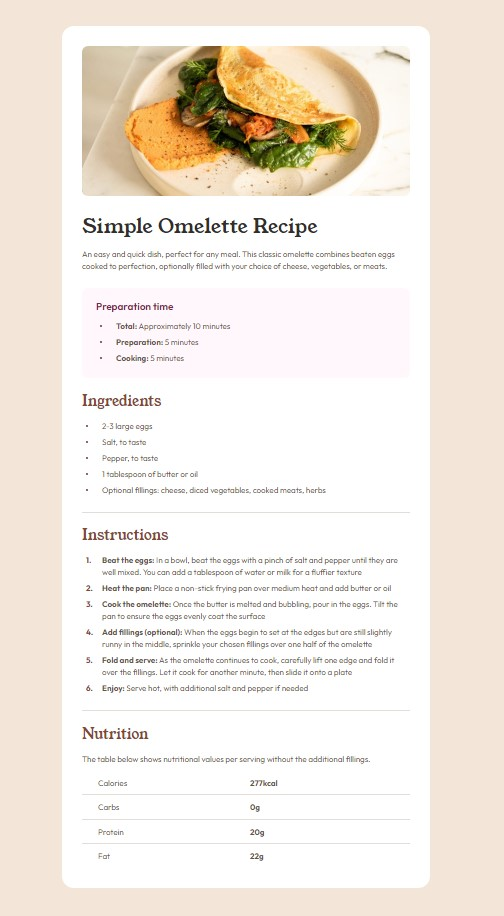

# Frontend Mentor - Social links profile solution

This is a solution to the [Recipe page challenge on Frontend Mentor](https://www.frontendmentor.io/challenges/recipe-page-KiTsR8QQKm). Frontend Mentor challenges help you improve your coding skills by building realistic projects.

## Table of contents

- [Overview](#overview)
  - [Screenshot](#screenshot)
  - [Links](#links)
- [My process](#my-process)
  - [Built with](#built-with)
  - [Continued development](#continued-development)
- [Author](#author)

## Overview

### Screenshot

### Links

- Solution URL: [https://github.com/Roman-oryol/recipe-page](https://github.com/Roman-oryol/recipe-page)
- Live Site URL: [https://ro-recipe-page.netlify.app/](https://ro-recipe-page.netlify.app//)

## My process

### Built with

- [React](https://reactjs.org/) - JS library
- [Styled Components](https://styled-components.com/) - For styles

### Continued development

React development

## Author

- Frontend Mentor - [Roman-oryol](https://www.frontendmentor.io/profile/Roman-oryol)
